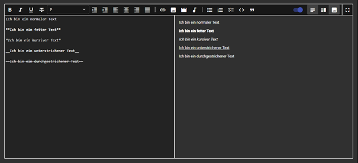
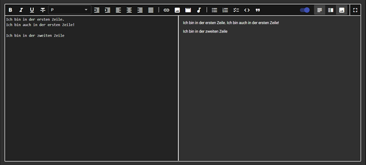
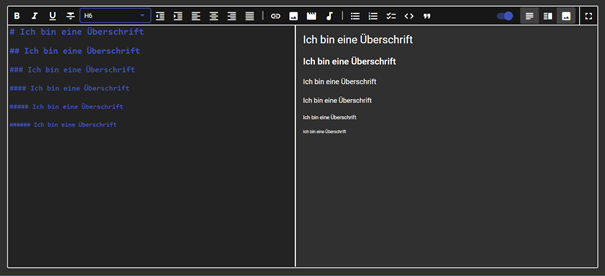
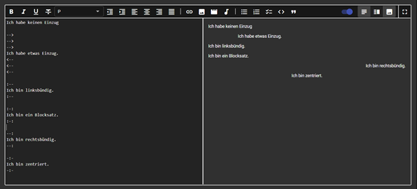
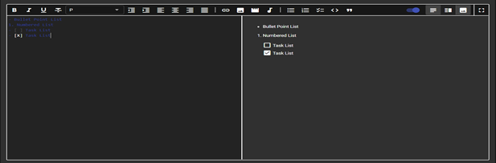
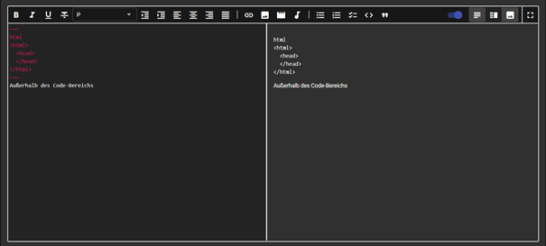
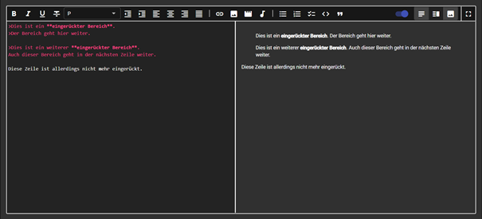

# BENUTZERHANDBUCH FÜR AUTOREN
## Editor

Der Editor bietet Ihnen eine einfache und schnelle Möglichkeit den Inhalt der Website der Pfarre Machstraße zu ändern. Die folgenden Unterpunkte sollen Ihnen die Verwendung des Editors näherbringen.

### Allgemeines

#### Editor starten

Um überhaupt Zugriff auf den Editor zu erhalten, müssen Sie sich erstmal auf der Website mit Ihren Benutzerdaten einloggen. Dies machen Sie über den Login-Button. Danach wechseln Sie auf eine der Unterseiten die Sie verändern wollen. Falls Sie die nötigen Berechtigungen zum Verändern haben, sollten Sie am unteren rechten Bildschirmrand ein Kreis-Symbol mit einem Stift innen drinnen sehen. Durch drücken auf dieses Symbol wird man zum Editor weitergeleitet. 

#### Editor verstehen

Nachdem Sie den Editor gestartet haben zeigt er Ihnen zwei Fenster mit dem aktuellen Inhalt der Unterseite an. Das linke Fenster zeigt den Markdown-Code und das rechte Fenster die Preview, also das was im linken Fenster geschrieben  wurde und was man dann auch normal auf der Unterseite sehen würde. Sie werden auf dem linken Fenster arbeiten. Wenn sie den Inhalt geändert haben drücken sie zum Speichern auf das Symbol unten rechts am Bildschirm wo vorher das Editieren-Symbol war.

Die Icons die Sie über den beiden Fenstern sehen, erfüllen alle eine bestimmte Funktionen und dienen dazu Ihnen die Schreibarbeit zu erleichtern. Bewegen Sie Ihre Maus über einen der Icons wird Ihnen gleich seine Funktion verraten. Die letzten 4 Icons sind dazu da um entweder nur das Mark-Down oder Preview-Fenster anzuzeigen oder auch um den Editor auf Vollbild zu stellen. Die restlichen Icons werden in den nachfolgenden Punkten erklärt.

### Markdown

#### Schriftarten

Der Editor arbeitet unter der Sprache Markdown. Mit dieser Sprache kann man seine Texte ganz einfach verzieren. Hier finden Sie Erklärungen zu den wichtigsten Verzierungen.

Bold – Fett

Um im Editor einen Text Fett aussehen zu lassen muss man nur den gewünschten Text markieren und kann dann das B-Icon (erstes von Links) drücken. Andernfalls können Sie am Anfang und am Ende des gewünschten Textes zwei Sterne („**“) hinzufügen. Dies Erzielt den gleichen Effekt wie das drücken des Icons.

Italic – Kursiv

Um im Editor einen Text Kursiv aussehen zu lassen muss man nur den gewünschten Text markieren und kann dann das I-Icon (zweite von Links) drücken. Andernfalls können Sie am Anfang und am Ende des gewünschten Textes einen Stern („*“) hinzufügen. Dies Erzielt den gleichen Effekt wie das drücken des Icons.

Underline – Unterstreichen

Um im Editor einen Text unterstreichen zu lassen muss man nur den gewünschten Text markieren und kann dann das U-Icon (dritte von Links) drücken. Andernfalls können Sie am Anfang und am Ende des gewünschten Textes zwei Unterstriche („__“) hinzufügen. Dies Erzielt den gleichen Effekt wie das drücken des Icons.

Strikethrough – Durchstreichen

Um im Editor einen Text durchstreichen zu lassen muss man nur den gewünschten Text markieren und kann dann das T-Icon (vierte von Links) drücken. Andernfalls können Sie am Anfang und am Ende des gewünschten Textes zwei Wellen („~~“) hinzufügen. Dies Erzielt den gleichen Effekt wie das drücken des Icons.

Hier noch ein Beispiel wie das ganze im Editor dann aussehen würde.

#### Zeilenumbruch

Nur einmal die Enter-Taste zu drücken reicht in Markdown nicht um einen Zeilenumbruch zu verursachen. Um in die nächste Zeile zu gehen muss man eine Zeile Abstand zwischen den beiden Texten halten, also zwei Mal die Enter-Taste betätigen. Der nachfolgende Screenshot soll das ganze veranschaulichen.

#### Überschriften

Um eine Überschrift zu erzeugen, kann man den Drop-Down nutzen. Dieser ermöglicht, wie bei HTML, Überschriften von 1 bis 6. Jeder größer die Zahl desto niedriger die Überschrift. Das ganze kann man auch selbst erstellen indem man vor einem Text eine Raute und dann ein Leerzeichen eingibt.

#### Ausrichtung

Mit Markdown lässt sich, wie bei Word auch, ganz einfach die Ausrichtung eines Textes ändern. Dazu sollte man die vorgegebenen Icons im Editor nutzen, da sich der eigentliche Markdown-Code schwer zu merken ist.

Decrease Indent – Einzug verkleinern

Um im Editor den Einzug zu verkleinern, drückt man das Einzug-Nach-Links-Icon (Erstes Icon nach dem Drop-Down). Der Standard-Text startet automatisch schon ganz links mit keinem Einzug, weshalb diese Funktion nur benötigt wird falls man einen rechtsbündigen Text hat.

Increase Indent – Einzug vergrößern

Um im Editor den Einzug zu vergrößern, drückt man das Einzug-Nach-Rechts-Icon (Zweites Icon nach dem Drop-Down). Das Icon kann man mehrmalig drücken und den Text dadurch immer weiter nach rechts schieben. In Markdown wäre der Code dafür Pfeile nach rechts am Anfang(„-->“) und Pfeile nach links am Ende („<--“).

Align left – Linksbündig ausrichten

Um im Editor einen Text linksbündig ausrichten zu lassen muss man nur den gewünschten Text markieren und kann dann das Linksbündig-Icon (Drittes Icon nach dem Drop-Down). drücken. Andernfalls können Sie am Anfang und am Ende des gewünschten Textes einen Doppelpunkt mit zwei Minus-zeichen („:--“) hinzufügen. Dies Erzielt den gleichen Effekt wie das drücken des Icons.

Align right – Rechtsbündig ausrichten

Um im Editor einen Text rechtsbündig ausrichten zu lassen muss man nur den gewünschten Text markieren und kann dann das Rechtsbündig-Icon (Fünftes Icon nach dem Drop-Down). drücken. Andernfalls können Sie am Anfang und am Ende des gewünschten Textes zwei Minus-zeichen mit einem Doppelpunkt am Ende („--:“) hinzufügen. Dies Erzielt den gleichen Effekt wie das drücken des Icons.

Align center – Zentriert

Um im Editor einen Text zu zentrieren, also in der Mitte zu platzieren, muss man nur den gewünschten Text markieren und kann dann das Zentrieren-Icon (viertes Icon nach dem Drop-Down). drücken. Andernfalls können Sie am Anfang und am Ende des gewünschten Textes zwei Minus-Zeichen mit einem Doppelpunkt dazwischen („-:-“) hinzufügen. Dies Erzielt den gleichen Effekt wie das drücken des Icons.

Align justify – Blocksatz

Um im Editor einen Text in einen Blocksatz umwandeln zu lassen muss man nur den gewünschten Text markieren und kann dann das Blocksatz-Icon (sechstes Icon nach dem Drop-Down). drücken. Andernfalls können Sie am Anfang und am Ende des gewünschten Textes zwei Doppelpunkte mit einem Minus-zeichen dazwischen („:-:“) hinzufügen. Dies Erzielt den gleichen Effekt wie das drücken des Icons.

Hier noch ein Beispiel wie das Ganze im Editor dann aussehen würde.

#### Listen

Markdown bietet einem 3 Arten von Listen an. Diese sind einfach zu erstellen und der Editor besitzt noch zusätzlich Icons für die 3 Arten.

Liste mit Bulletpoints – unsortierte Liste

Um diese Liste zu erzeugen drückt man das Punktlisten-Icon (3 Punkte mit Linien daneben). Für diese Listenart verwendet man entweder das Plus-Zeichen, den Bindestrich oder einen Stern. Alle drei Varianten werden zum gleichen Ergebnis führen.

Nummerierte Liste – sortierte Liste

Um diese Liste zu erzeugen drückt man das Reihenlisten-Icon (3 Zahlen mit Linien daneben). Diese Listenart erzeugt man durch eine Zahl mit einem direkt darauffolgendem Punkt.

Checkliste

Um diese Liste zu erzeugen drückt man das Checklisten-Icon (2 Häkchen mit Linien daneben). Dies erzeugt eine nicht angekreuztes Kästchen mit Text daneben. In Markdown wäre das ein Minus mit einem Abstand und eckigen Klammern dahinter(„- [ ]“). Schreibt man ein X zwischen die eckigen Klammern so wird das Kästchen im Preview-Fenster angehäkelt. 

Hier noch ein Beispiel wie das Ganze im Editor dann aussehen würde.

#### Links einfügen

Man kann in Markdown auch ganz einfach Links einfügen. Für die wichtigen Links, die zu einer der Unterseiten der Pfarre führen soll, ist ein eigenes Icon vorgegeben. Sie müssen dafür nur das Büroklammer-Icon (Links vom Bild-Icon) drücken. Es öffnet sich danach ein Pop-Up-Fenster in welchem Sie die gewünschte Unterseite anklicken können. Nachdem Sie eins ausgewählt haben wird der Link dazu automatisch erstellt. Falls sie eigene Links machen oder auf externe Seiten verweisen wollen schreiben sie einfach eine eckige Klammer ("[]") gefolgt von zwei runden Klammern ("()"). In die eckigen Klammern kommt der Name des Links und in die runden Klammern der Link selber hinein.

Hier noch ein Beispiel wie das Ganze im Editor dann aussehen würde.
 

#### Bilder einfügen

#### Video einfügen

#### Audio einfügen

#### Code

Der Code-Bereich in Markdown sorgt dafür das Zeilenumbrüche und Abstände sofort gelten. Also alles was man in den Code-Bereich eingibt wird auch eins zu eins im Preview-Fenster gespeigelt. Dazu drückt man das Code-Icon("<>"-Icon). Andernfalls kann man es durch drei Wellen-Zeichen selber schreiben ("~~~").

Hier noch ein Beispiel wie das Ganze im Editor dann aussehen würde.

#### Zitate

Zitate in Markdown sorgen für sofortige Zeilenumbrüche und haben automatisch eine Einrückung nach rechts. Dazu drückt man das Reference-Icon(Icon mit dem Anführungszeichen). Wenn man es selber eingeben will muss man nur das Größer-Zeichen vor dem Text eingeben.

Hier noch ein Beispiel wie das Ganze im Editor dann aussehen würde.

## Glossar

